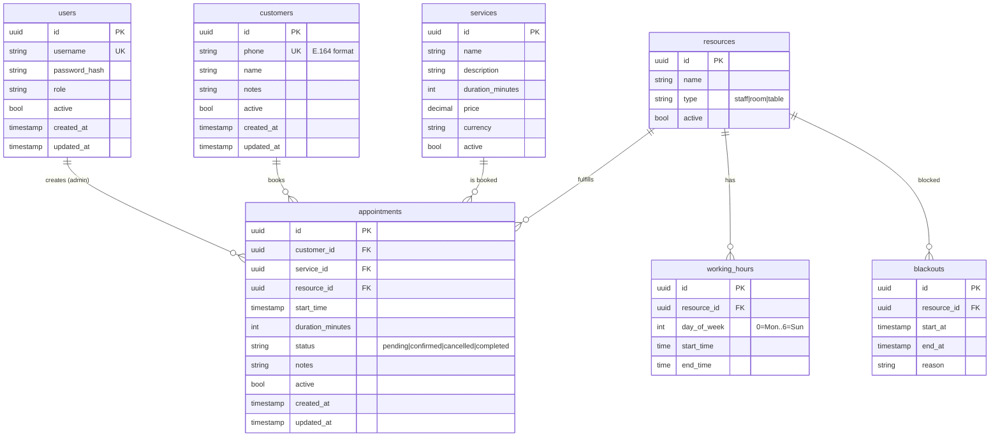

# Database Schema

A snapshot of the data model. Phase 1 ships only `users` and
`appointments`; the other tables in this document are planned for
Phase 2 (see [roadmap](../roadmap.md)).

## Entity-relationship overview

## Tables

All tables inherit `id (UUID)`, `created_at`, `updated_at`, and
`active (bool)` from `BaseModel` in `app/models.py`. Soft deletes only
— set `active = false` rather than removing rows.

### `users` (Phase 1)

The admin user. JWT-authenticated. Default admin bootstrapped on first
startup from `DEFAULT_ADMIN_USERNAME` / `DEFAULT_ADMIN_PASSWORD`.

### `appointments` (Phase 1 — minimal stub; Phase 2 adds FKs)

Phase 1 stub fields:

- `customer_name`, `customer_phone` (denormalized — gets normalized
  into a `customers` table in Phase 2).
- `start_time`, `duration_minutes`.
- `status` enum: `pending`, `confirmed`, `cancelled`, `completed`.
- `notes`.

Phase 2 changes:

- Drop `customer_name` / `customer_phone`; add `customer_id` FK.
- Add `service_id` FK and `resource_id` FK.

### `customers` (Phase 2)

Keyed by phone number (unique). Created automatically on first
`book_appointment` MCP call.

### `services` (Phase 2)

The catalog. Each service has a duration and a price.

### `resources` (Phase 2)

Generic — staff member, room, table. Type is a free-form string in v1;
becomes an enum if a clear pattern emerges.

### `working_hours` (Phase 2)

One row per resource per day-of-week per time range. A resource with
split shifts (lunch break) has multiple rows for that day.

### `blackouts` (Phase 2)

Vacation, sick day, holiday. Beats appointments — booking inside a
blackout is rejected.

## Booking validation rules

When creating an appointment in Phase 2:

1. Computed `end_time = start_time + service.duration_minutes`.
2. `start_time` and `end_time` must fall entirely inside the resource's
   working hours for that weekday.
3. The interval must not overlap any blackout for the resource.
4. The interval must not overlap any other active appointment for the
   same resource.

## Migrations

Phase 1: `Base.metadata.create_all()` at startup. Schema is mutable
without version control.

Phase 2 onward: Alembic. Add when the schema stops changing weekly.
