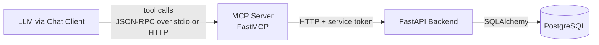

# MCP Server Architecture

The MCP server is **not yet implemented**. This page describes the
target design; the draft tool list lives in
[Ideas / MCP Design](../ideas/mcp-design.md).

## Goals

- Expose only the *customer-facing* subset of the booking domain as
  MCP tools.
- Stay strictly separate from the backend so the LLM can never reach
  admin endpoints.
- Be runnable standalone (own image, own port) so it can scale or be
  deployed elsewhere if needed.

## Tech

- **FastMCP** (Python). Same Python version (3.13) and same tooling
  (uv, ruff, pyright) as the backend. Lives under `mcp/`.

## Component diagram

## Authentication

The MCP server authenticates to the backend with a **service token**
(static, in env). Customer identity is passed as a tool argument
(`customer_phone`); the MCP layer enforces ownership checks before
forwarding to the backend.

## Tool surface

See the draft list in [Ideas / MCP Design](../ideas/mcp-design.md). It
will harden into a contract here once the first tool ships.

## Not in MCP

- Admin operations (create/update/delete services, resources, working
  hours, customer records).
- Any operation that returns data across customers.
- Hard deletes.

These remain REST-only on the backend. The trust boundary between MCP
(public-facing, LLM-accessible) and REST admin API (internal, JWT)
is the most important architectural choice.
