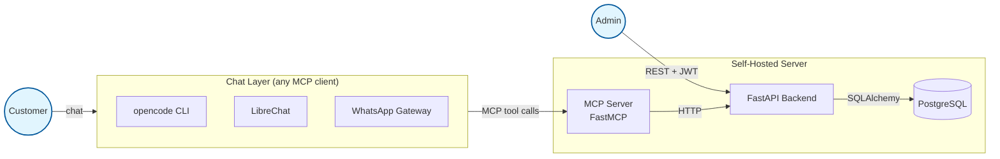

# Architecture (sketch)

A first sketch. Hardens into [Architecture / Backend](../architecture/backend.md)
and [Architecture / MCP Server](../architecture/mcp.md) once the design
settles.

## Components

## Data flow — booking from chat

1. Customer types: *"can I book a haircut Saturday at 10?"*
2. Chat client routes the message to the LLM with the MCP tool list
   attached (`list_services`, `check_availability`,
   `book_appointment`, …).
3. LLM calls `check_availability(service_id, date_range)`.
4. MCP server hits the backend (e.g. `GET /api/v1/availability?…`),
   computes open slots, returns them.
5. LLM picks one, asks the customer to confirm, then calls
   `book_appointment(...)`.
6. MCP server hits the backend (e.g. `POST /api/v1/appointments`),
   which runs conflict checks, persists, and returns the new
   appointment.
7. LLM confirms back to the customer in plain language.

## Data flow — admin

1. Admin logs in via `POST /api/v1/auth/login`, receives a JWT.
2. Admin hits any REST endpoint with `Authorization: Bearer <jwt>`.
3. Admin never goes through the MCP server (that surface is for
   customers).

## Why FastMCP between LLM and backend?

You could let the LLM call REST directly. Don't:

- **Trust boundary.** REST is the admin surface. The MCP layer is the
  only public-customer surface. Mixing them invites prompt-injection
  damage.
- **Argument shape.** MCP tools advertise rich JSON schemas the LLM
  reads natively. REST OpenAPI is too verbose and noisy.
- **Ownership checks.** `cancel_appointment` requires that the caller's
  phone matches the appointment's customer. That check belongs at the
  MCP layer once, not duplicated across REST endpoints.

## Authentication model

| Caller        | Surface | Mechanism |
|---------------|---------|-----------|
| Admin         | REST    | JWT (username + password login) |
| MCP server    | REST    | Service-to-service token (TBD; likely a static signed token in env) |
| Customer      | MCP     | Phone number passed as argument; verified per-call |
| Chat client   | MCP     | Whatever the MCP transport offers (stdio for local, HTTP+token for hosted) |

The MCP service-to-service token vs per-customer auth question is
[open](mcp-design.md#authentication-questions).
